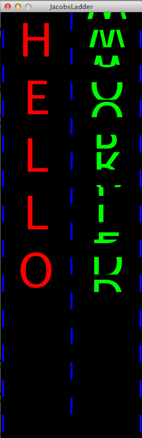
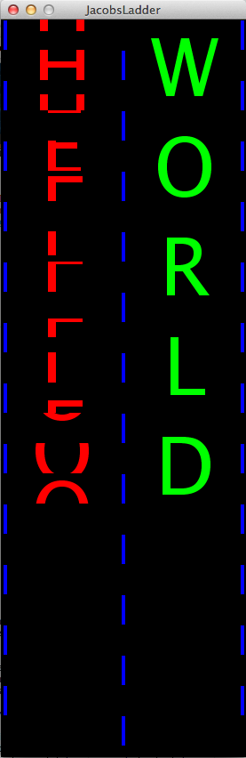

This is a quick sketch to Proof-of-Concept an idea about how to use a Jacob's Ladder as a sign for displaying two states.
Each letter you type pushes that letter to the end of the next side and "flips" the ladder. I just keep hitting the spacebar
at the end to continue simulating flipping the ladder without adding more visible content.

